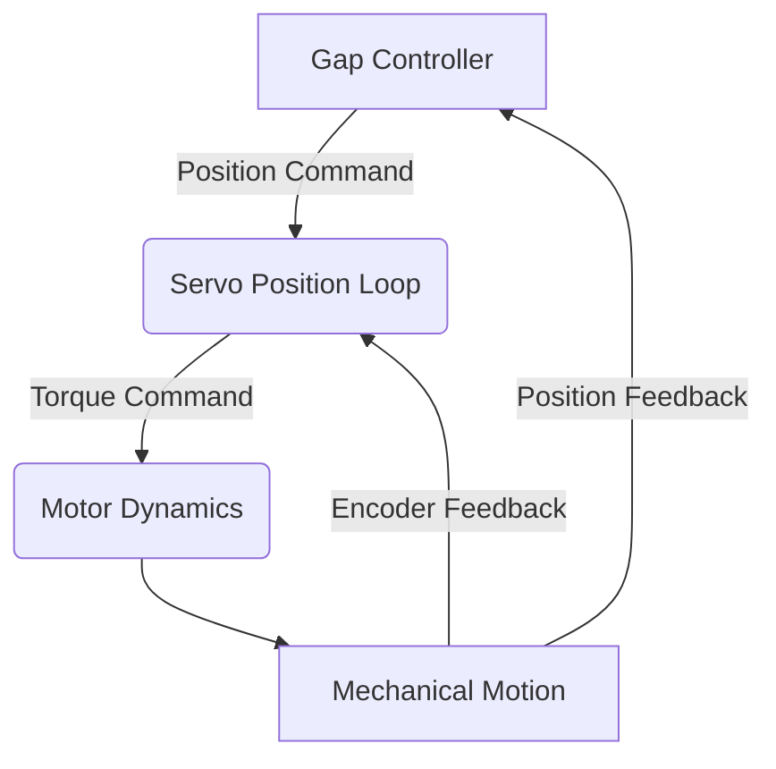

# Servo Control System for Wire Positioning
## Control Hierarchy in Wire EDM

This document provides a theoretical description of the **Mechanics Module** in our Wire EDM simulation. In this module, we simulate the behavior of a servo motor responsible for the 1D positioning of the wire electrode. The servo motor is a key component in CNC machines (like Agie Charmilles with Beckhoff PLCs), translating voltage commands into precise mechanical positioning through a closed-loop control system.

---

## 1. Overview

In typical CNC Wire EDM systems, the servo motor:
- **Receives a command signal** (usually a voltage proportional to the target position).
- **Implements a closed-loop control** via an internal PID (or PD) controller using encoder feedback.
- **Drives a mechanical transmission** (often a ballscrew assembly) to convert the motor's rotation into linear motion of the wire.

The simulation framework updates the servo command every 1 ms, but the underlying mechanical dynamics are integrated with a finer resolution (1 μs timestep). This multi-scale approach allows us to capture the transient dynamics of the servo motor and the mechanical linkage without incurring significant computational overhead.

---

## 2. Key Modeling Assumptions

Based on your background and requirements, our initial servo motor model will:

- **Assume a simplified dynamic response:**  
  We capture the essential servo behavior using a second-order linear system that approximates the closed-loop response of the internal controller and mechanical transmission.

- **Abstract the internal PID loop:**  
  The model assumes that the servo's internal control (and the subsequent mechanical drive) can be represented by a lumped second-order dynamic system. This means we do not simulate the detailed internal workings of the servo but focus on its overall response to a commanded position.

- **Hold the command constant between updates:**  
  The commanded (target) position is updated every 1 ms. Between these updates, the servo is assumed to operate under a constant target while its position evolves according to the dynamics described below.

- **Be extensible:**  
  While the initial model is simple and lightweight, it is designed to serve as a baseline for potential future extensions (e.g., incorporating friction, backlash, or noise).
- **Include Acceleration Saturation:**
  The model incorporates a maximum acceleration limit, reflecting the physical constraints of the motor and drive system.

---

## 3. Theoretical Model

### 3.1. Dynamic Model

A common and effective way to model the servo dynamics is to approximate the position response of the servo axis as a **second order system** with acceleration saturation. The error between the target position  $x_d(t)$ and the actual position $x(t)$ is corrected over time.

The nominal acceleration, $\ddot{x}_{nom}(t)$, is calculated according to the second-order differential equation:

$$
\ddot{x}_{nom}(t) + 2\zeta \omega_n \dot{x}(t) + \omega_n^2 \Bigl(x(t) - x_d(t)\Bigr) = 0,
$$
which can be rearranged as:
$$
\ddot{x}_{nom}(t) = - 2\zeta \omega_n \dot{x}(t) - \omega_n^2 \Bigl(x(t) - x_d(t)\Bigr)
$$

where:
- $x(t)$ is the actual position of the axis at time $t$.
- $x_d(t)$ is the commanded (target) position.
- $\omega_n$ is the natural frequency of the system (which sets the speed of response).
- $\zeta$ is the damping ratio (which influences overshoot and settling time).

This formulation represents a *closed-loop system* where the servo tries to drive the error $e(t) = x_d(t) - x(t)$ to zero. The response characteristics are:

- **Underdamped** ($\zeta < 1$): Rapid response with possible overshoot.
- **Critically damped** ($\zeta = 1$): Fastest response without overshoot.
- **Overdamped** ($\zeta > 1$): Slower response with no overshoot.

Since CNC machines typically favor precision over speed, a critically damped or slightly underdamped system is common.

The actual acceleration, $\ddot{x}(t)$, is then obtained by clamping the nominal acceleration to a maximum value, $\ddot{x}_{max}$:

$$
\ddot{x}(t) =
\begin{cases}
\ddot{x}_{nom}(t), & \text{if } |\ddot{x}_{nom}(t)| \le \ddot{x}_{max} \\
\text{sign}(\ddot{x}_{nom}(t)) \cdot \ddot{x}_{max}, & \text{otherwise}
\end{cases}
$$

### 3.2. Discrete-Time Considerations

In our simulation:
- **Servo Update Interval:**  
  The target position $x_d$ is updated every 1 ms (i.e., every 1000 μs).
- **Integration Step:**  
  The system's dynamics are integrated at a microsecond resolution. During each 1 ms interval, the target position is fixed, and the servo/ballscrew subsystem evolves continuously according to the differential equation above.

A simple numerical integration (such as Euler's method or a more stable method) can be applied at the microsecond level to update the position and velocity:

$$
\begin{aligned}
\dot{x}(t+\Delta t) &\approx \dot{x}(t) + \ddot{x}(t)\, \Delta t, \\
x(t+\Delta t) &\approx x(t) + \dot{x}(t)\, \Delta t,
\end{aligned}
$$

with $\Delta t = 1 \mu s$.

---

## 4. Mathematical Formulation

### 4.1. Second-Order Servo Dynamics with Acceleration Saturation

The servo model, including acceleration saturation, is defined as follows:

Nominal Acceleration:
$$
\ddot{x}_{nom}(t) = - 2\zeta \omega_n \dot{x}(t) - \omega_n^2 \, (x(t) - x_d(t))
$$
Actual Acceleration (with saturation):
$$
\ddot{x}(t) =
\begin{cases}
\ddot{x}_{nom}(t), & \text{if } |\ddot{x}_{nom}(t)| \le \ddot{x}_{max} \\
\text{sign}(\ddot{x}_{nom}(t)) \cdot \ddot{x}_{max}, & \text{otherwise}
\end{cases}
$$

These equations can be interpreted as follows:
- **Nominal Acceleration ($\ddot{x}_{nom}(t)$)**: Represents the acceleration commanded by the second-order system.
- **Damping Term ($2\zeta \omega_n \dot{x}(t)$)**: Represents energy dissipation (from mechanical friction and the control system's damping).
- **Stiffness Term ($\omega_n^2 (x(t) - x_d(t))$)**: Represents the corrective force driving the system toward the target.
- **Acceleration Saturation**:  Limits the actual acceleration to $\pm \ddot{x}_{max}$, reflecting physical motor/drive constraints.

### 4.2. Parameter Selection

The parameters $\omega_n$, $\zeta$, and $\ddot{x}_{max}$ are chosen based on the mechanical and control characteristics of the actual servo motor system. For example:
- A higher $\omega_n$ implies a faster system response.
- The damping ratio $\zeta$ is typically set to around 1 for critically damped response, ensuring minimal overshoot and rapid settling.
-  $\ddot{x}_{max}$ represents the maximum achievable acceleration of the axis. Typical values for Wire EDM machines with Beckhoff drives can range from 1 to 5 m/s², depending on the specific axis and machine design.

---

## 5. Discussion and Future Extensions

The simplified servo model provides a lightweight yet physically meaningful description of the linear actuation mechanism used in Wire EDM machines. While the base model is kept simple for computational efficiency, it lays the groundwork for future enhancements, such as:

- **Incorporating Non-Idealities:**  
  Adding elements for friction, backlash in the mechanical transmission, and noise in the encoder feedback.
  
- **Advanced Control Strategies:**  
  While we abstract the internal PID loop of the servo, more sophisticated outer-loop controllers (such as those adjusting the gap in Wire EDM) can be introduced without altering the servo dynamics model.

- **Parameter Tuning:**  
  The model parameters $\omega_n$, $\zeta$, and $\ddot{x}_{max}$ can be adjusted based on experimental data or more detailed knowledge of specific machines (e.g., Agie Charmilles setups) to better reflect real-world behavior.

---

## Conclusion

The Mechanics Module is designed to simulate the servo-controlled movement of the wire electrode in our Wire EDM simulation. By modeling the servo dynamics with a second-order linear differential equation and including acceleration saturation, we achieve a balance between simplicity and realism. This approach allows us to capture the essential transient behavior of the servo motion while providing a foundation for future refinements.

With this theoretical framework established, we can now move on to implementing the code for this module, ensuring that our simulation accurately reflects the mechanical behavior of low-level servo control in a CNC Wire EDM machine.
